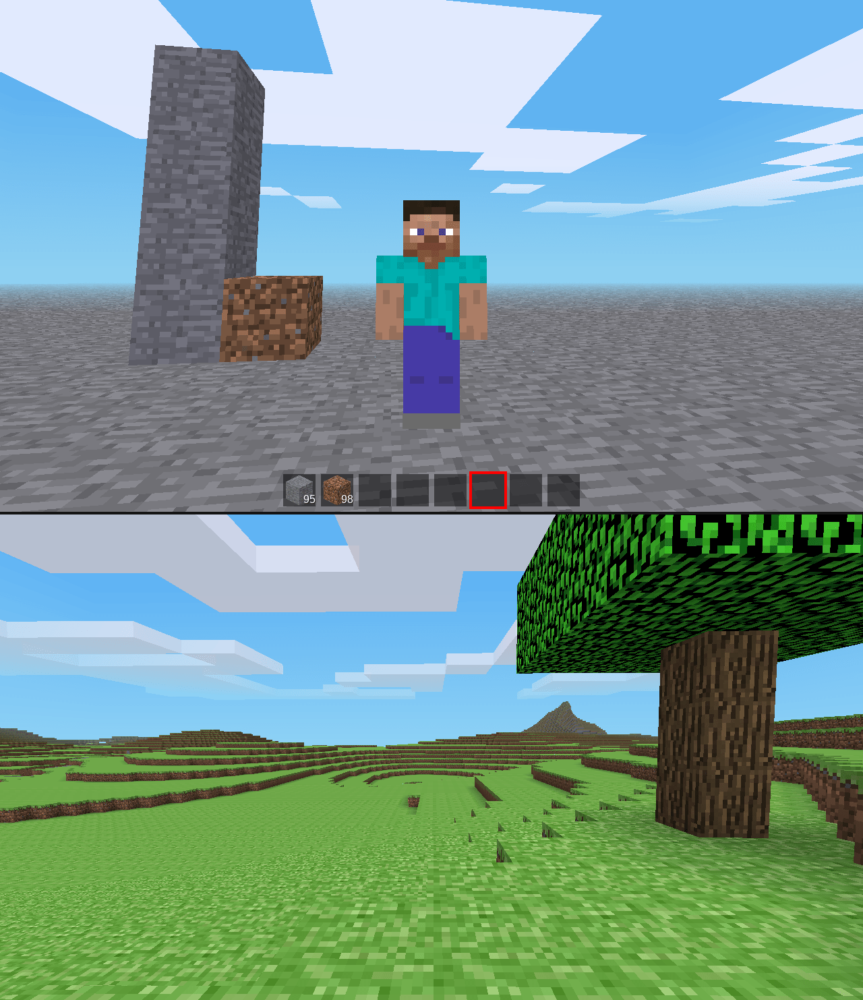

Minecraftn't was first started on the 1st of April 2021 by Danil_2461. At this time, it did not yet have a name.

```
<Danil_2461> i will recreate a1.0 in mt 😳
<Danil_2461> it should be fairly easy yea?
```



Sometime later, the project was named Minecraftn't, a pun on how it's Minecraft, yet not, using **-n't** which is an English shorthand for the word **not**.

It started fairly simple, copying over the Minecraft textures and recreating basic blocks. The Minecraft-like inventory was also implemented, albeit a much earlier version than the one that can be seen in Minecraftn't today.

On the 3rd of April, the Minecraftn't Github repository was created. Some days later, ROllerozxa decided to also start working on it, first putting the blocks together into an alpha-esque grasslands biome.

After that, development steadily continued with both Danil and ROllerozxa working on the game.
